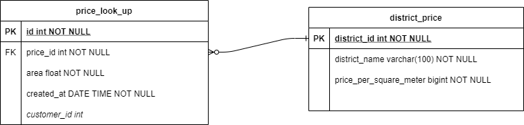

# Real Estate Price Look Up Service

##Entity Relaition

##APIS
API to check for real estate price based on area and district

    POST /api/price-look-ups/check-up

    {
	"districtPriceId": 2,
	"area": 26.052
    }
    
API to get look up history

    GET /api/price-look-ups?page=0&size=3&sort=id,DESC
    
I've also added some basic district for look up

| Id | Name |
|----|------|
|1|Hoang Mai|
| 2|Hai Ba Trung|
| 3|Thanh Xuan|
| 4|Cau Giay|
| 5|Ba Dinh|
| 6|Hoan Kiem|
| 7|Tay Ho|
 |8|Ha Dong|